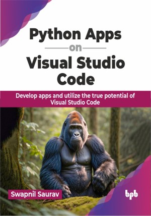

# Python Apps on Visual Studio Code

Supercharge your Python skills: Build stunning apps using Visual Studio Code 

This is the repository for [Python Apps on Visual Studio Code
](https://in.bpbonline.com/products/python-apps-on-visual-studio-code?variant=44674091352302),published by BPB Publications.

## About the Book
Python is the most user-friendly programming language, and with VS Code, coding becomes even easier. VS Code is a code editor that supports tasks like debugging and version control. This book will help readers enhance basic programming skills, create efficient Python applications with ease, and skip lengthy learning hours for smart development.

Utilize the capabilities of Visual Studio Code with this book. From setting up the environment to developing Python applications, this book will help you explore various aspects of Visual Studio Code. Go in-depth with advanced topics like building desktop databases, mastering algorithms, and creating multi-threading applications. The readers will learn to create a Jupyter Dashboard, edit Jupyter Notebooks, master Tkinter GUI, and develop Flask web applications. Explore container work in Azure for a complete understanding of using VS Code in diverse development scenarios.

By the end of this book, the readers will become self-reliant coding experts by creating smart solutions.  

## What You Will Learn
• Set up and configure Visual Studio Code for Python development.

• Use top extensions in Visual Studio Code to enhance productivity.

• Design advanced algorithms and build multi-threading applications.

• Master GUI development with Tkinter and build Flask-based web applications.

• Work with containers in Azure for deployment.
